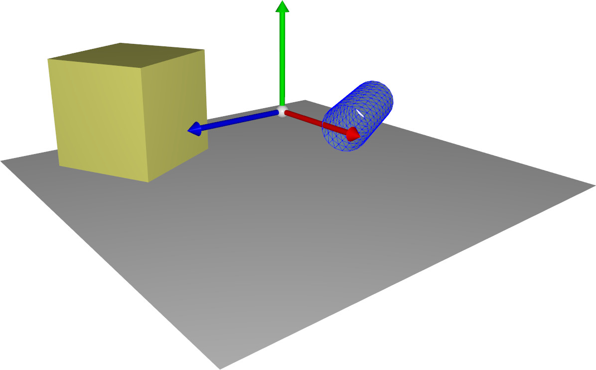

# CGP Example

A basic example of 3D animated scene using CGP. The sliders can be used to displace and rotate the shapes. All the custom code of the scene can be seen in the files src/scene.cpp (and .hpp).

