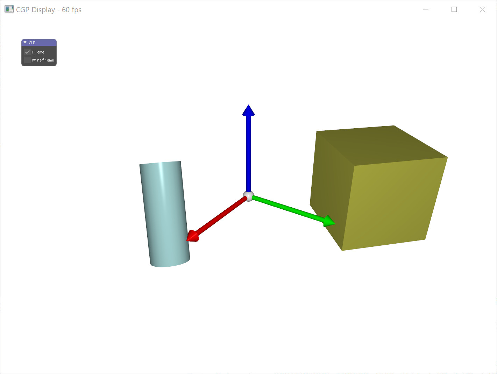

# Default scene single file

This code represent a complete 3D scene using a single file (src/main.cpp). All the structure, events and data initialization are done explicitely in this single file. This organization can be usefull for fast prototyping where all global data are directly accessible.

