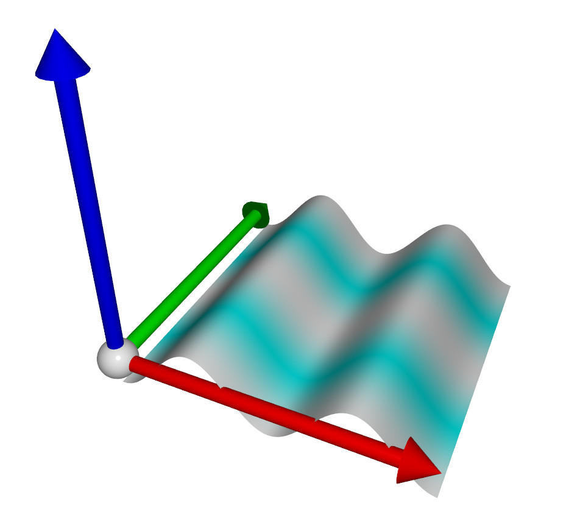

# Shape evolving dynamically

This code shows the use of __mesh_drawable.update()__ to change dynamically the shape at every frame. The deformation is applied on the CPU and then transfered to the GPU.

(an even more efficient approach would be to directly apply the deformation in the shader - see shader_effects for an example)

