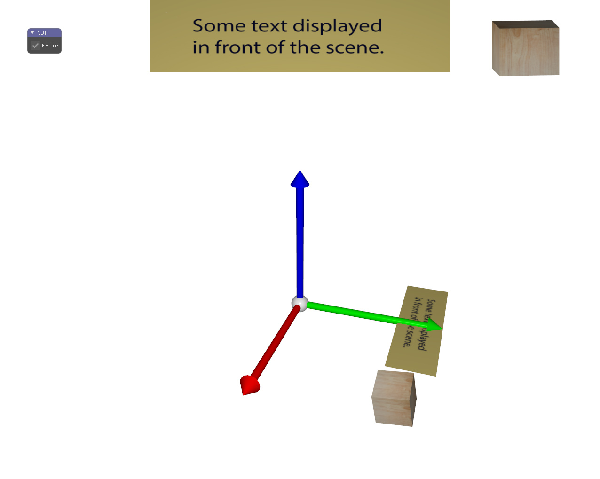

# Multiple cameras

This code shows the use of several cameras to display the same shapes under different viewpoints.
The text quad and the cube are first displayed using the standard camera, and then displayed using a fixed camera and under orthographic projection. Such display can be usefull to display some persistant information in the viewspace.

